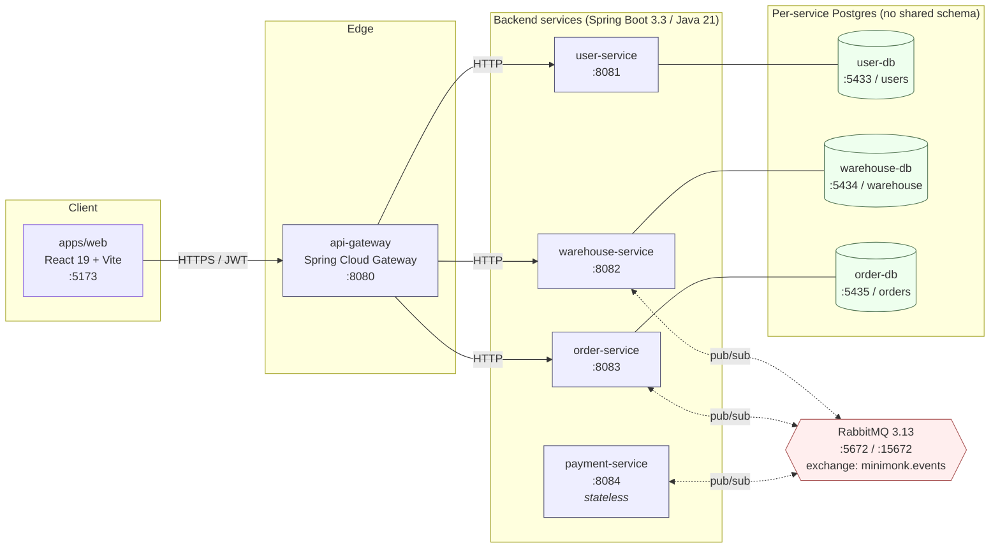
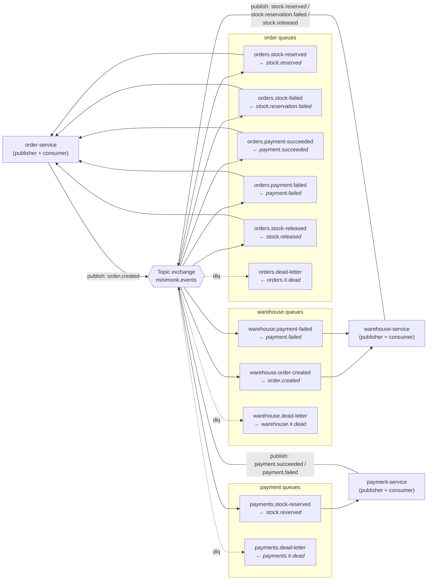
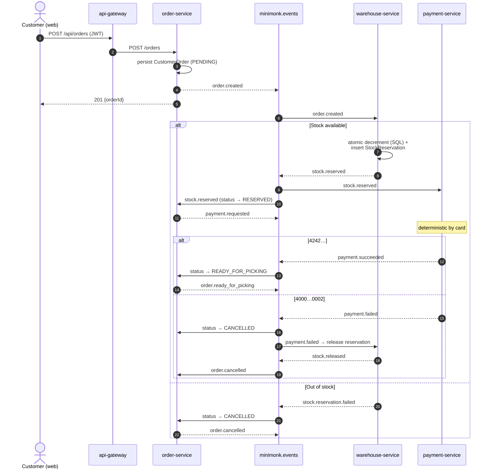
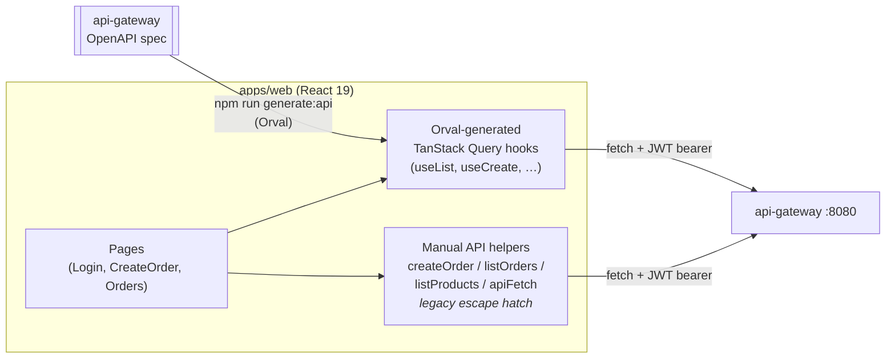

# Architecture at a glance

Quick visual reference for how Minimonk is wired together. Diagrams are Mermaid — they render inline on GitHub and most markdown viewers.

For the canonical design rationale, see [`plans/warehouse-logistics-plan.md`](plans/warehouse-logistics-plan.md).

---

## 1. System overview (containers)

How the pieces are deployed and who talks to whom synchronously vs. asynchronously.



**Rules of the road**

- Services talk to each other **only** through RabbitMQ events. There is no service-to-service HTTP.
- The gateway forwards HTTP to services via env-configured URLs (`USER_SERVICE_URL`, `WAREHOUSE_SERVICE_URL`, `ORDER_SERVICE_URL`).
- JWTs are validated **in every service**, not just the gateway (defense in depth — `common-security` provides `JwtSupport` + `JwtAuthenticationFilter`).
- `payment-service` is stateless: deterministic success/failure based on card number.

---

## 2. RabbitMQ topology

Single topic exchange `minimonk.events`; one durable queue per (consumer × event-it-listens-to); every queue has a dead-letter route back through the same exchange.



Defined in `services/{order,warehouse,payment}-service/.../config/RabbitConfig.java`. `RabbitConfig` is the most-connected node in the codebase graph — renaming an exchange/queue/binding here ripples through multiple services, so change deliberately.

---

## 3. Order lifecycle (happy path + failure branches)

End-to-end event choreography for one order. Listeners are **idempotent** (gated by `ProcessedEvent` table per service), so duplicate deliveries are safe.



The flow is also summarised one-liner-style as: `order.created → stock.reserved | stock.reservation.failed → payment.requested → payment.succeeded | payment.failed → order.ready_for_picking | order.cancelled (+ stock.released)`.

---

## 4. Frontend → backend wiring



After backend contract changes, regenerate the hooks: `cd apps/web && npm run generate:api`. Prefer the generated hooks; don't add new manual helpers without a reason.

---

## 5. Cross-cutting patterns (load-bearing, not optional)

| Pattern | Where it lives | What it guarantees |
| --- | --- | --- |
| **JWT in every service** | `libs/common-security` (`JwtSupport`, `JwtAuthenticationFilter`); each service's `SecurityConfig` | A bypassed/compromised gateway can't grant unauthorized access; endpoint-level role checks per service. |
| **Idempotent handlers** | `ProcessedEvent` + `ProcessedEventRepository` in order- and warehouse-service | Duplicate event deliveries don't double-transition orders or double-release stock. |
| **Durable queues + DLQ** | `RabbitConfig` in each consumer service | Messages survive broker restarts; poison messages route to `*.dead-letter` instead of looping. |
| **Event envelope + dedup ID** | `RabbitEventPublisher` (`libs/common-events`) wraps payloads in `EventEnvelope` with a UUID | Stable ID for the idempotency check above. |
| **Atomic stock decrement** | SQL-level in warehouse-service; contract pinned by `ProductRepositoryTest` | No oversells under concurrent reservations. |
| **DTO projection for order list** | `OrderOverviewDto` in `OrderService` | Avoids N+1 lazy-loading items per row on the orders list. |

---

## 6. Repo map (where to look)

```
services/
  api-gateway/        Spring Cloud Gateway, JWT pre-check
  user-service/       AppUser, AuthController, JWT issuance
  warehouse-service/  Product, StockReservation, WarehouseEventListener
  order-service/      CustomerOrder, OrderEventListener, PaymentListener
  payment-service/    stateless, deterministic by card #
libs/
  common-events/      RabbitEventPublisher, EventEnvelope, payload DTOs
  common-observability/
  common-security/    JwtSupport, JwtAuthenticationFilter
apps/web/             React 19 + Vite SPA, Orval-generated hooks
docker/
  docker-compose.yml  full stack: rabbit + 3× postgres + 5 services + web
docs/
  plans/warehouse-logistics-plan.md   canonical design doc
graphify-out/         knowledge-graph snapshot (see GRAPH_REPORT.md)
```

---

## Demo credentials

Password is always `password` for: `customer`, `operator`, `admin`.
Card `4242424242424242` → payment succeeds. Card `4000000000000002` → deterministic failure (exercises the cancellation + stock-release branch).
